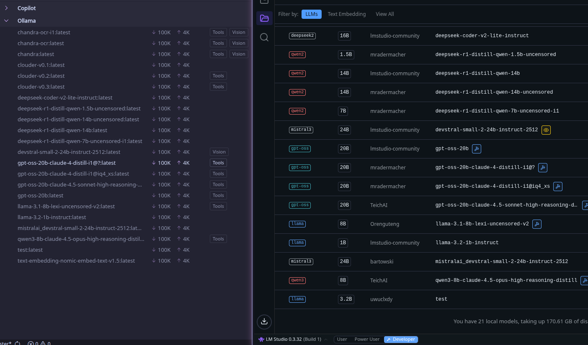

# Ollama ↔ LM Studio Proxy

Proxy server that bridges **Ollama API** and **LM Studio**

Useful if you want to **connect models from LM Studio to applications that support only Ollama API** (such as Copilot in
VS Code).

> ⚠️ This project was in the majority vibe coded. I only want to let you know, despite me regularly using it. **Feel
free to report any bugs or auditing code before use!**



## Highlights

- Native LM Studio REST API (`/api/v1/*`) plus OpenAI-compatible passthrough (`/v1/*`) mapped to Ollama endpoints
- Automatic model name mapping to Ollama format (with virtual aliases stored on disk)
- **Streaming**: Optimized SSE processing with chunk recovery and cancellation
- Auto-retry, model preload hints, and catalog-backed downloads via `/api/pull`

## Configuration

### CLI Options

| Flag                                   | Default                 | Description                       |
|----------------------------------------|-------------------------|-----------------------------------|
| `--listen`                             | `0.0.0.0:11434`         | Server bind address               |
| `--lmstudio_url`                       | `http://localhost:1234` | LM Studio URL                     |
| `--log-level`                          | `info`                  | Set log level                     |
| `--load_timeout_seconds`               | `15`                    | Model loading timeout             |
| `--model_resolution_cache_ttl_seconds` | `300`                   | Cache TTL for model resolution    |
| `--max_buffer_size`                    | `262144`                | Buffer size for streaming (bytes) |
| `--enable_chunk_recovery`              | `false`                 | Enable stream chunk recovery      |

## LM Studio API Compatibility

Requires LM Studio **0.3.6+**. Legacy mode is removed; `/v1/*` requests are forwarded directly, while Ollama endpoints
translate to LM Studio native APIs.

### Endpoint Support

| Ollama Endpoint                | Legacy API             | Native API                  | Notes                                          |
|--------------------------------|------------------------|-----------------------------|------------------------------------------------|
| `GET /api/tags`                | —                      | ✅ `/api/v1/models`          | Includes proxy-managed aliases                 |
| `GET /api/ps`                  | —                      | ✅ `/api/v1/models`          | Shows loaded models (plus aliases)             |
| `POST /api/show`               | —                      | ✅ *Real metadata*           | Adds alias metadata when present               |
| `POST /api/chat`               | —                      | ✅ `/v1/chat/completions`    |                                                |
| `POST /api/generate`           | —                      | ✅ `/v1/completions`         | Vision support via chat endpoint               |
| `POST /api/embed`              | —                      | ✅ `/v1/embeddings`          | Also supports `/api/embeddings`                |
| `GET /api/version`             | —                      | ✅ *Proxy response*          |                                                |
| `GET /health`                  | —                      | ✅ *Health check*            | Validates LM Studio reachability               |
| `POST /v1/*`                   | ✅ *Direct passthrough* | ✅ *Direct passthrough*      |                                                |
| `POST /api/create`             | —                      | ✅ *Proxy alias*             | Creates virtual aliases (no custom blobs)      |
| `POST /api/pull`               | —                      | ✅ `/api/v1/models/download` | Streams LM Studio catalog downloads            |
| `POST /api/push`               | —                      | ✅ *Acknowledged*            | No-op; validates target model                  |
| `POST /api/delete`             | —                      | ✅ *Proxy alias only*        | Removes proxy-managed aliases                  |
| `POST /api/copy`               | —                      | ✅ *Proxy alias*             | Duplicates aliases or targets LM Studio models |
| `HEAD/POST /api/blobs/:digest` | —                      | ✅ *Proxy storage*           | Stores/validates blobs for manifests           |

### Virtual model aliases

- `/api/create` and `/api/copy` manage aliases stored under
  `$XDG_CACHE_HOME/ollama-lmstudio-proxy/virtual_models.json` (fallback: system temp). Metadata such as `system`,
  `template`, `parameters`, `license`, `adapters`, and `messages` is merged into subsequent requests.
- `/api/delete` removes only proxy-managed aliases. `/api/show` returns LM Studio metadata plus alias info when present.
- `/api/pull` streams LM Studio catalog downloads (or blocks when `"stream": false`); optional `quantization` and
  `source` fields are forwarded.

## Installation options

### 1. Pre-built Binaries

1. Download the latest release from the [Releases](https://github.com/uwuclxdy/ollama-lmstudio-proxy/releases) page.
2. Extract and run the binary in the terminal.

### 2. Source

```bash
# Clone the repository
git clone https://github.com/uwuclxdy/ollama-lmstudio-proxy.git
cd ollama-lmstudio-proxy

# Build release version
cargo build --release

# Run
./target/release/ollama-lmstudio-proxy
```

### 3. Cargo

```bash
cargo install --git https://github.com/uwuclxdy/ollama-lmstudio-proxy.git
```

## Quick Start

### Basic Usage

```bash
# Start with default settings (native API)
ollama-lmstudio-proxy

# Custom configuration
ollama-lmstudio-proxy \
  --listen 0.0.0.0:11434 \
  --lmstudio_url http://localhost:1234 \
  --load_timeout_seconds 30
```

**Make sure the Ollama server is not running when using the proxy!**

## Request Shapes & Examples

The proxy understands two payload styles:

- **Ollama-style**: advanced parameters belong in `options`. Use this when calling `/api/*` endpoints.
- **OpenAI-style passthrough**: send OpenAI-compatible JSON to `/v1/*` and the proxy forwards it untouched.

When you target Ollama endpoints, keep fields such as `temperature`, `num_predict`, `max_tokens`, `logit_bias`, and
structured `format` values inside the `options` object (or top-level `format`), and the proxy will translate them to LM
Studio's native parameters. You can set `"format": "json"` for quick JSON responses or provide a JSON Schema object (also
acceptable inside `options.format`) to take advantage of LM Studio's structured output enforcement.

### Option mappings

The proxy automatically forwards or converts these knobs for you:

| Ollama option              | LM Studio parameter                  | Notes                                                      |
|----------------------------|--------------------------------------|------------------------------------------------------------|
| `temperature`, `top_p`     | Same name                            | Direct passthrough                                         |
| `top_k`                    | `top_k`                              | Direct passthrough                                         |
| `presence_penalty`         | `presence_penalty`                   | Direct passthrough                                         |
| `frequency_penalty`        | `frequency_penalty`                  | Direct passthrough                                         |
| `repeat_penalty`           | `repeat_penalty`/`frequency_penalty` | Mapped depending on what is already provided               |
| `max_tokens`/`num_predict` | `max_tokens`                         | Picks whichever you set, with `max_tokens` taking priority |
| `logit_bias`               | `logit_bias`                         | Works with either JSON or map notation                     |
| `system` (in `options`)    | `system`                             | Injected as LM Studio system prompt                        |
| `stop`, `seed`             | Same name                            | Direct passthrough                                         |

If you do not need structured output, you can still pass overrides such as `stop`, `seed`, or additional
OpenAI-compatible payloads and the proxy will pass them through untouched.
