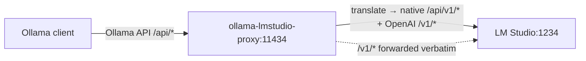

<div align="center">

# Ollama to LMStudio Proxy

**Use LM Studio models with anything that speaks Ollama API.**

VSCode Copilot, Claude Code, and any other Ollama client talk to this proxy.
It translates their requests and hands them to LM Studio.

[](https://github.com/uwuclxdy/ollama-lmstudio-proxy/actions/workflows/release.yml)
[](LICENSE)
[](https://crates.io/crates/ollama-lmstudio-proxy)
[](https://crates.io/crates/ollama-lmstudio-proxy)

[Features](#-features) · [How it works](#-how-it-works) · [Install](#-installation) · [Quick start](#-quick-start) · [Alternatives](#-alternatives) · [FAQ](#-faq) · [Docs](#-documentation)


</div>

## ✨ Features

- **Full translation:** Ollama endpoints map to LM Studio native (`/api/v1/*`) and OpenAI-compatible (`/v1/*`) equivalents.
- **Model name mapping:** LM Studio ids are exposed under clean Ollama-style names automatically.
- **Streaming:** SSE responses with optional chunk recovery and cancellation.
- **Reasoning:** thinking/reasoning is detected per model; `think` / `reasoning_effort` are honored and the model's reasoning is surfaced in the `thinking` field. Thinking-capable models default to reasoning on when `think` is omitted, matching real Ollama.
- **Real token metrics:** chat/generate report LM Studio's actual `eval_count` / `eval_duration` / `prompt_eval_*`. Non-streaming reads them from the `/api/v0` stats block; streaming reports real stats when routed through the native `/api/v1/chat` path (`--native-chat-streaming` or `--use-native-chat`), and falls back to wall-clock estimates on the default v0 stream (LM Studio's v0 SSE has no final stats chunk).
- **Context window:** per-request `options.num_ctx` reloads the model at that context length before inference (LM Studio treats context as a load-time setting); an already-correct instance is reused, so repeated requests don't pile up duplicates. A server-wide default (`--default-context-length` / `OLLAMA_CONTEXT_LENGTH`) applies when requests omit `num_ctx`.
- **Embeddings:** `/api/embed` and `/api/embeddings` auto-load an unloaded embedding model on demand (JIT), the same way chat/generate do, and honor `num_ctx`.
- **Downloads:** `/api/pull` streams catalog downloads straight from LM Studio.
- **Passthrough:** Anthropic Messages (`/v1/messages`) and OpenAI Responses (`/v1/responses`) work out of the box.
- **Web fetch:** `/api/web_fetch` retrieves a URL and returns `{title, content, links}` (HTML rendered to markdown) — no cloud account needed.
- **Web search:** `/api/web_search` forwards to a search provider you configure with `--search-url` (optional `--search-api-key`); returns `{results}` (501 until configured).
- **Auth:** optional inbound Bearer gate via `--api-key` / `OLLAMA_API_KEY`; when unset the proxy is fully open (default). Requires `Authorization: Bearer <key>` on every request when set.
- **Auto-evict:** `--auto-evict` unloads other models' instances before loading a requested model (mirrors Ollama's single-model default). Aimed at single-tenant setups; in a multi-client deployment one client's load evicts another's.
- **Native mode:** route chat through LM Studio's `/api/v1/chat` backend with `--use-native-chat` (all requests) or `--native-chat-streaming` (streaming only) for richer per-event reasoning/tool-call streaming and MCP tools.

## 🔁 How it works


```mermaid
flowchart LR
    Client["Ollama client<br/>"]
    Proxy["ollama-lmstudio-proxy:11434"]
    LM["LM Studio:1234"]

    Client -->|"Ollama API /api/*"| Proxy
    Proxy -->|"translate → native /api/v1/* + OpenAI /v1/*"| LM
    Proxy -.->|"/v1/* forwarded verbatim"| LM
```

Clients think they are talking to a real Ollama server. The proxy rewrites the
`model` field, reshapes the payload, and forwards it to LM Studio. It then
translates the response back into Ollama's format.

## 📦 Installation

### Cargo (recommended)

```bash
cargo install ollama-lmstudio-proxy
```

### Pre-built binary

Download the latest build from the [Releases](https://github.com/uwuclxdy/ollama-lmstudio-proxy/releases)
page and run it.

### From source

```bash
cargo install --git https://github.com/uwuclxdy/ollama-lmstudio-proxy.git
```

## 🚀 Quick start

Requires LM Studio **0.3.6+**.

```bash
# Default settings (binds 0.0.0.0:11434, talks to LM Studio on :1234)
ollama-lmstudio-proxy

# Common overrides
ollama-lmstudio-proxy \
  --listen 0.0.0.0:11434 \
  --lmstudio-url http://localhost:1234 \
  --load-timeout-seconds 30
```

> [!WARNING]
> Stop any Ollama server first. It would otherwise grab the same port.

The flags above cover most setups. For the full list, including experimental
options, see [Configuration](https://github.com/uwuclxdy/ollama-lmstudio-proxy/wiki/Configuration).

Any client that speaks the Anthropic Messages or OpenAI API can point straight at the proxy.
LM Studio serves `/v1/messages` natively, the proxy will pass through those requests unchanged.

## 🤝 Alternatives

Pick by the protocol your client speaks:

| Tool | What it does | Difference |
|------|--------------|------------|
| **ollama-lmstudio-proxy** (this) | Speaks the Ollama API, forwards to LM Studio | One Ollama endpoint, LM Studio behind it |
| [ollama-lmstudio-bridge](https://github.com/eelbaz/ollama-lmstudio-bridge), [Ollm-Bridge](https://github.com/Les-El/Ollm-Bridge) | Symlink model files between Ollama and LM Studio on disk | Shares model files on disk, no request translation; you still run two servers |
| [LiteLLM](https://github.com/BerriAI/litellm) | Multi-provider proxy, can use LM Studio as a backend | OpenAI in and out; no Ollama API |
| [llama-swap](https://github.com/mostlygeek/llama-swap) | OpenAI-compatible router with automatic model swapping | OpenAI protocol only; no Ollama API |

Use this when your client speaks Ollama and you want LM Studio as the backend. For
OpenAI-native clients, LiteLLM or llama-swap fit better.

## ❓ FAQ

**How do I use LM Studio with the Ollama API?**
Run this proxy on port `11434`, start LM Studio on `1234`, and point your Ollama client at
`http://localhost:11434`. The proxy translates Ollama requests to LM Studio and back.

**Can I use Claude Code with LM Studio?**
Yes. Claude Code speaks the Anthropic Messages API, which LM Studio serves natively at
`/v1/messages`. The proxy forwards it unchanged.

**How do I connect VSCode Copilot or Open WebUI to LM Studio?**
Set the client's Ollama host to `http://localhost:11434`. Model names appear in Ollama style,
streaming works, and reasoning and tool calls run when the model supports them.

**Does it support streaming, reasoning, and tool calls?**
Yes. SSE streaming with chunk recovery and cancellation, per-model `think` /
`reasoning_effort`, and tool calling (richest on the native `/api/v1/chat` path).

**Is this the same as the Ollama / LM Studio "bridge" symlink tools?**
No. Those share model files on disk and run two separate servers. This proxy translates API
requests, so a single Ollama endpoint fronts LM Studio.

**Do I need to stop Ollama first?**
Yes. Ollama and the proxy both want port `11434`, so stop the Ollama server before starting.

## 📚 Documentation

The [wiki](https://github.com/uwuclxdy/ollama-lmstudio-proxy/wiki) holds full technical reference:

| Page | What's inside |
|------|---------------|
| [Configuration](https://github.com/uwuclxdy/ollama-lmstudio-proxy/wiki/Configuration) | Every CLI flag, env var, and experimental option |
| [API Compatibility](https://github.com/uwuclxdy/ollama-lmstudio-proxy/wiki/API-Compatibility) | Per-endpoint behaviour, passthrough rules, virtual aliases |
| [Request Shapes and Options](https://github.com/uwuclxdy/ollama-lmstudio-proxy/wiki/Request-Shapes-and-Options) | Ollama vs OpenAI payload styles and option mappings |
| [MCP Integrations](https://github.com/uwuclxdy/ollama-lmstudio-proxy/wiki/MCP-Integrations) | Forwarding MCP tools through the native chat path |

## 🛠️ Development

```bash
cargo build           # debug build
cargo test            # run the test suite
cargo run -- --help   # see every flag
```

`api-docs/` is the source of truth for upstream API behavior. Issues and pull
requests are welcome.

## 📄 License

[MIT](LICENSE)
