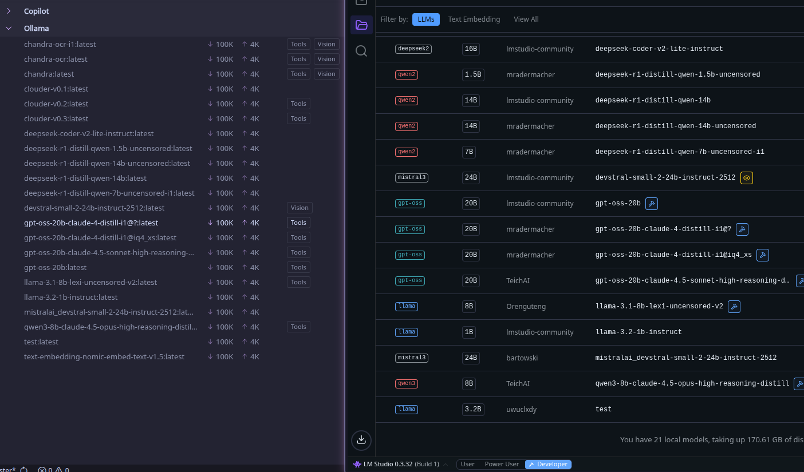

# Ollama to LM Studio (Proxy)

[](https://github.com/uwuclxdy/ollama-lmstudio-proxy/actions/workflows/release.yml)

Proxy server that gives access to **LM Studio** through **Ollama API**

Useful if you want to use **LM Studio models through Ollama API** (for example Copilot in VSCode).

> [!IMPORTANT]
> This project is in the majority vibe coded. I just want to let you know, despite me regularly using it. **Please report any bugs or auditing code before use!**



## Highlights

- Ollama API endpoints translated to LM Studio native (`/api/v1/*`) and OpenAI-compatible (`/v1/*`) equivalents
- Automatic model name mapping to Ollama format
- SSE processing response streaming with chunk recovery and cancellation
- Thinking/reasoning capability detection for models
- Auto-retry, model preload hints, and catalog-backed downloads via `/api/pull`
- Anthropic Messages (`/v1/messages`) and OpenAI Responses (`/v1/responses`) passthrough — point Claude Code straight at the proxy
- Optional native `/api/v1/chat` backend (`--use-native-chat`) for richer reasoning events, accurate stats, and MCP tools

## Installation

### Cargo (Recommended)

```bash
cargo install ollama-lmstudio-proxy
```

### Pre-built Binary

1. Download the latest release from the [Releases](https://github.com/uwuclxdy/ollama-lmstudio-proxy/releases) page.
2. Run the binary in terminal.

### Source

```bash
# Clone the repository
git clone https://github.com/uwuclxdy/ollama-lmstudio-proxy.git
cd ollama-lmstudio-proxy

# Build release version
cargo build --release

# Run
./target/release/ollama-lmstudio-proxy
```

## Quick Start

### Basic Usage

```bash
# Start with default settings
ollama-lmstudio-proxy

# Custom configuration
ollama-lmstudio-proxy \
  --listen 0.0.0.0:11434 \
  --lmstudio-url http://localhost:1234 \
  --load-timeout-seconds 30
```

**Make sure the Ollama server is not running (on the same port)!**

## Configuration

### CLI Options

| Flag                                    | Default                 | Description                                              |
|-----------------------------------------|-------------------------|----------------------------------------------------------|
| `--listen`                              | `0.0.0.0:11434`         | Server bind address                                      |
| `--lmstudio-url`                        | `http://localhost:1234` | LM Studio URL                                            |
| `--log-level`                           | `info`                  | `off`, `error`, `warn`, `info`, `debug`, `trace`; also reads `RUST_LOG` |
| `--load-timeout-seconds`                | `15`                    | Model loading wait timeout in seconds (after trigger)    |
| `--model-resolution-cache-ttl-seconds`  | `300`                   | Cache TTL for model resolution                           |
| `--max-buffer-size`                     | `262144`                | Initial buffer size for SSE message assembly (bytes)     |
| `--enable-chunk-recovery`               | `false`                 | Enable partial chunk recovery for streams                |
| `--lmstudio-token`                      | —                       | Bearer token for LM Studio auth (`LMSTUDIO_TOKEN` env); sent on backend requests, overridden by a caller-supplied `Authorization` |
| `--use-native-chat`                     | `false`                 | Experimental: route `/api/chat` through LM Studio native `/api/v1/chat` for richer reasoning events and accurate stats |
| `--flash-attention`                     | `false`                 | Experimental: enable flash attention when loading models via `/api/v1/models/load` |
| `--offload-kv-cache`                    | `false`                 | Experimental: offload KV cache to GPU when loading models via `/api/v1/models/load` |
| `--eval-batch-size`                     | —                       | Experimental: set eval batch size when loading models via `/api/v1/models/load` |

## LM Studio API Compatibility

Requires LM Studio **0.3.6+**. `/v1/*` requests are forwarded directly, while Ollama endpoints
translate to LM Studio native API equivalents.

### Endpoint Support

| Endpoint                        | Behaviour                                                          |
|---------------------------------|--------------------------------------------------------------------|
| `GET /`                         | Returns "Ollama is running"                                        |
| `GET /api/tags`                 | Translates to `/api/v1/models`; includes proxy-managed aliases     |
| `GET /api/ps`                   | Translates to `/api/v1/models`; shows loaded models plus aliases   |
| `POST /api/show`                | Fetches real LM Studio metadata; merges alias info when present    |
| `POST /api/chat`                | Translates to `/v1/chat/completions` (or native `/api/v1/chat` with `--use-native-chat`) |
| `POST /api/generate`            | Translates to `/v1/completions`; vision requests use chat endpoint |
| `POST /api/embed`               | Translates to `/v1/embeddings`; also handles `/api/embeddings`     |
| `GET /api/version`              | Returns proxy version in Ollama format                             |
| `GET /health`                   | Validates LM Studio reachability                                   |
| `POST /api/create`              | Creates proxy-managed virtual aliases (no custom blobs)            |
| `POST /api/pull`                | Translates to `/api/v1/models/download`; streams download progress |
| `POST /api/push`                | Returns 501 — LM Studio has no model registry                      |
| `POST /api/web_search`          | Returns 501 — cloud-only Ollama feature, no LM Studio backend      |
| `POST /api/web_fetch`           | Returns 501 — cloud-only Ollama feature, no LM Studio backend      |
| `DELETE /api/delete`            | Removes proxy-managed aliases only                                 |
| `POST /api/copy`                | Duplicates aliases or references LM Studio models                  |
| `HEAD/POST /api/blobs/:digest`  | Stores and validates blobs for alias manifests                     |

`ANY /v1/*` and `ANY /api/v1/*` are forwarded directly to LM Studio without modification. This
includes `POST /v1/messages` (Anthropic-compat) and `POST /v1/responses` (OpenAI Responses),
which LM Studio serves natively — the proxy remaps the `model` field from the Ollama-style name
to the resolved LM Studio id before forwarding.

### Anthropic / Claude Code clients

Clients that speak the Anthropic Messages API (including Claude Code) can point directly at the
proxy. LM Studio handles `/v1/messages` natively, so no extra configuration is needed beyond
setting the base URL.

```bash
export ANTHROPIC_BASE_URL=http://localhost:11434
export ANTHROPIC_AUTH_TOKEN=ollama
```

Then run Claude Code as usual — use any Ollama-style model name:

```bash
claude --model granite-4-micro
```

The token is accepted but not validated; any non-empty value works.

### Virtual model aliases

- `/api/create` and `/api/copy` manage aliases stored under
  `$XDG_CACHE_HOME/ollama-lmstudio-proxy/virtual_models.json` (fallback: `$HOME/.cache/ollama-lmstudio-proxy/`, then system temp). Metadata such as `system`,
  `template`, `parameters`, `license`, `adapters`, and `messages` is merged into subsequent requests.
- `/api/delete` removes only proxy-managed aliases. `/api/show` returns LM Studio metadata plus alias info when present.
- `/api/pull` streams LM Studio catalog downloads (or blocks when `"stream": false`); optional `quantization` and
  `source` fields are forwarded.

## Request Shapes & Examples

The proxy understands two payload styles:

- **Ollama-style**: model parameters belong in `options`. Use this when calling `/api/*` endpoints.
- **OpenAI-style passthrough**: send OpenAI-compatible JSON to `/v1/*` and the proxy forwards it untouched.

When you target Ollama endpoints, put fields such as `temperature`, `num_predict`, `max_tokens`, `logit_bias`, and
structured `format` values inside the `options` object (or top-level `format`). The proxy translates them to LM
Studio's native parameters. Set `"format": "json"` for quick JSON responses or provide a JSON Schema object (also
accepted inside `options.format`) to use LM Studio's structured output enforcement.

### Option mappings

These parameters go inside the `options` object:

| Ollama option              | LM Studio parameter                  | Notes                                                      |
|----------------------------|--------------------------------------|------------------------------------------------------------|
| `temperature`, `top_p`     | Same name                            | Direct passthrough                                         |
| `top_k`                    | `top_k`                              | Direct passthrough                                         |
| `min_p`                    | `min_p`                              | Direct passthrough                                         |
| `presence_penalty`         | `presence_penalty`                   | Direct passthrough                                         |
| `frequency_penalty`        | `frequency_penalty`                  | Direct passthrough                                         |
| `repeat_penalty`           | `repeat_penalty`/`frequency_penalty` | Mapped depending on what is already set                    |
| `max_tokens`/`num_predict` | `max_tokens`                         | Picks whichever you set; `max_tokens` takes priority       |
| `num_ctx`                  | `context_length`                     | Context window size                                        |
| `logit_bias`               | `logit_bias`                         | Accepts JSON object or map notation                        |
| `system` (in `options`)    | `system`                             | Injected as LM Studio system prompt                        |
| `stop`, `seed`             | Same name                            | Direct passthrough                                         |
| `truncate`                 | `truncate`                           | Direct passthrough                                         |
| `dimensions`               | `dimensions`                         | Direct passthrough (embeddings)                            |

These parameters go at the **top level** of the request body (not inside `options`):

| Ollama field               | LM Studio parameter                  | Notes                                                                        |
|----------------------------|--------------------------------------|------------------------------------------------------------------------------|
| `think` / `reasoning_effort` | `reasoning`                        | `true`→`"on"`, `false`→`"off"`, `"none"`→`"off"`; levels `low\|medium\|high\|on\|off` pass through; `reasoning_effort` accepted as alias when `think` is absent |
| `logprobs`, `top_logprobs` | Same name                            | Direct passthrough                                                           |
| `suffix`                   | `suffix`                             | Forwarded on non-vision generate requests only                               |
| `raw`                      | —                                    | Disables system-prompt injection in generate requests                        |
| `keep_alive`               | `ttl`                                | Seconds (int) or duration string (`"5m"`); `0` unloads the model immediately |
| `integrations`             | `integrations`                       | **Native path only** (`--use-native-chat`). Array of MCP tool specs forwarded verbatim to LM Studio. See below. |

### MCP integrations (`--use-native-chat`)

When `--use-native-chat` is active, `/api/chat` accepts an `integrations` array that is forwarded
verbatim to LM Studio's `/api/v1/chat`. Non-array values are silently ignored.

Each element may be:

- A bare plugin-id string: `"huggingface"`
- A plugin object: `{"type": "plugin", "id": "browser", "allowed_tools": ["browser_navigate"]}`
- An ephemeral MCP server: `{"type": "ephemeral_mcp", "server_label": "hf", "server_url": "https://hf.co/mcp", "allowed_tools": ["model_search"], "headers": {}}`

Required LM Studio settings (under **Developer** in the LM Studio UI):

- **Allow calling servers from mcp.json** — enables `plugin` entries.
- **Allow per-request MCPs** — enables `ephemeral_mcp` entries.

If you do not need structured output, you can still pass overrides such as `stop`, `seed`, or additional
OpenAI-compatible payloads and the proxy will pass them through untouched.
