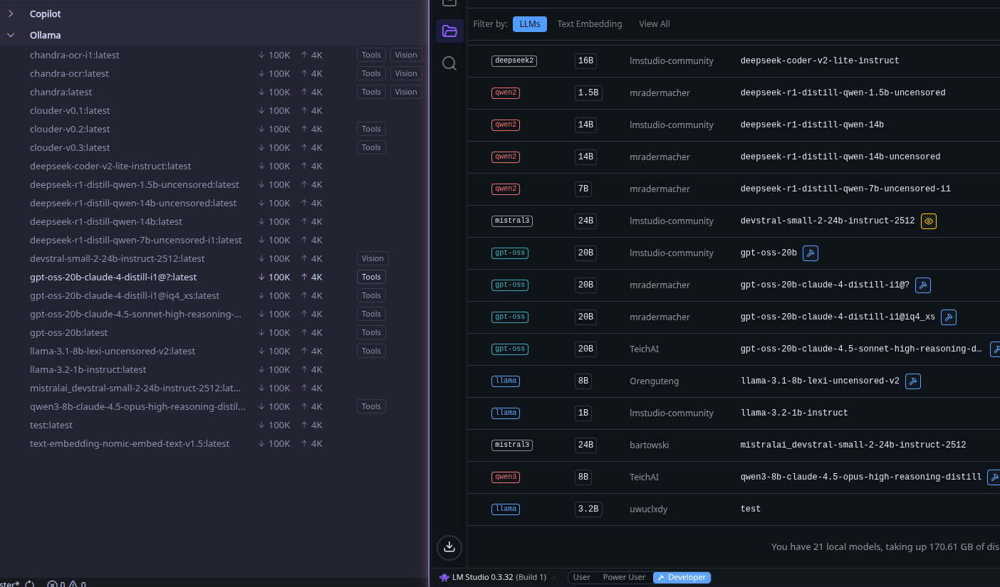

<div align="center">

# Ollama to LM Studio proxy

**Use LM Studio models with anything that speaks the Ollama API.**

Point any Ollama client at it: Claude Code, VSCode Copilot, Open WebUI.

[](https://github.com/uwuclxdy/ollama-lmstudio-proxy/actions/workflows/release.yml)
[](#-license)
[](https://crates.io/crates/ollama-lmstudio-proxy)
[](https://crates.io/crates/ollama-lmstudio-proxy)

[Features](#-features) · [Install](#-install) · [Quick start](#-quick-start) · [Alternatives](#-alternatives) · [FAQ](#-faq) · [Docs](#-documentation)



</div>

## ✨ Features

- **Every Ollama endpoint:** chat, generate, embeddings, tags, ps, show, pull, create, copy, delete, blobs.
- **Ollama-style model names:** Mapped from LM Studio ids. Aliases through `/api/create` and `/api/copy`.
- **Streaming:** SSE with cancellation. Real token counts on the native chat path, estimates on the default one.
- **Reasoning:** `think` and `reasoning_effort` honored, output in `thinking`. Reasoning models think by default, like Ollama.
- **Context window:** Per-request `num_ctx`, or a server-wide default. The model reloads to match.
- **Passthrough:** `/v1/*` and `/api/v1/*` go to LM Studio, model name remapped. Anthropic Messages and OpenAI Responses included.
- **Web tools:** `/api/web_fetch` and `/api/web_search`, no ollama.com account.
- **Optional auth:** Bearer gate through `--api-key`. Open when unset.
- **Daily update check on startup:** One log line, nothing else.

## 📦 Install

```bash
cargo install ollama-lmstudio-proxy
```

Pre-built binaries: [Releases](https://github.com/uwuclxdy/ollama-lmstudio-proxy/releases). From git: `cargo install --git https://github.com/uwuclxdy/ollama-lmstudio-proxy.git`.

## 🚀 Quick start

Needs LM Studio 0.4.0+.

```bash
# defaults: binds 0.0.0.0:11434, talks to LM Studio on :1234
ollama-lmstudio-proxy

# common overrides
ollama-lmstudio-proxy \
  --listen 0.0.0.0:11434 \
  --lmstudio-url http://localhost:1234 \
  --load-timeout-seconds 30
```

> [!WARNING]
> Stop Ollama first. It uses the same port.

Set the client's Ollama host to `http://localhost:11434`. Anthropic and OpenAI clients take the same address.

Every flag: [Configuration](https://github.com/uwuclxdy/ollama-lmstudio-proxy/wiki/Configuration).

## 🤝 Alternatives

Pick by the protocol your client speaks:

| Tool | What it does | Difference |
|------|--------------|------------|
| **ollama-lmstudio-proxy** (this) | Speaks the Ollama API, forwards to LM Studio | One Ollama endpoint, LM Studio behind it |
| [ollama-lmstudio-bridge](https://github.com/eelbaz/ollama-lmstudio-bridge), [Ollm-Bridge](https://github.com/Les-El/Ollm-Bridge) | Symlink model files between Ollama and LM Studio on disk | Shares files on disk, no request translation; two servers still run |
| [LiteLLM](https://github.com/BerriAI/litellm) | Multi-provider proxy, LM Studio as one backend | OpenAI in and out; no Ollama API |
| [llama-swap](https://github.com/mostlygeek/llama-swap) | OpenAI-compatible router with model swapping | OpenAI protocol only; no Ollama API |

Ollama client, LM Studio backend: this one. OpenAI-native client: LiteLLM or llama-swap.

## ❓ FAQ

**How do I use LM Studio with the Ollama API?**
Run the proxy on `11434`, LM Studio on `1234`, point the client at `http://localhost:11434`.

**Can I use Claude Code with LM Studio?**
Yes. `ANTHROPIC_BASE_URL=http://localhost:11434`. LM Studio serves `/v1/messages`, the proxy forwards it.

**How do I connect VSCode Copilot or Open WebUI to LM Studio?**
Set the Ollama host to `http://localhost:11434`. Streaming, reasoning and tool calls work where the model supports them.

**Do I need to stop Ollama first?**
Yes. Both use port `11434`.

## 📚 Documentation

The [wiki](https://github.com/uwuclxdy/ollama-lmstudio-proxy/wiki) is the full reference:

| Page | What's inside |
|------|---------------|
| [Configuration](https://github.com/uwuclxdy/ollama-lmstudio-proxy/wiki/Configuration) | Every CLI flag, env var, experimental option |
| [API Compatibility](https://github.com/uwuclxdy/ollama-lmstudio-proxy/wiki/API-Compatibility) | Per-endpoint behaviour, passthrough rules, virtual aliases |
| [Request Shapes and Options](https://github.com/uwuclxdy/ollama-lmstudio-proxy/wiki/Request-Shapes-and-Options) | Ollama vs OpenAI payload styles, option mappings |
| [MCP Integrations](https://github.com/uwuclxdy/ollama-lmstudio-proxy/wiki/MCP-Integrations) | MCP tools over the native chat path |

## 🛠️ Development

```bash
cargo test            # test suite
cargo run -- --help   # every flag
```

`api-docs/` is the source of truth for upstream API behavior. Issues and pull requests welcome.

## 📄 License

MIT or Apache-2.0, at your option. Contributions land under both.
